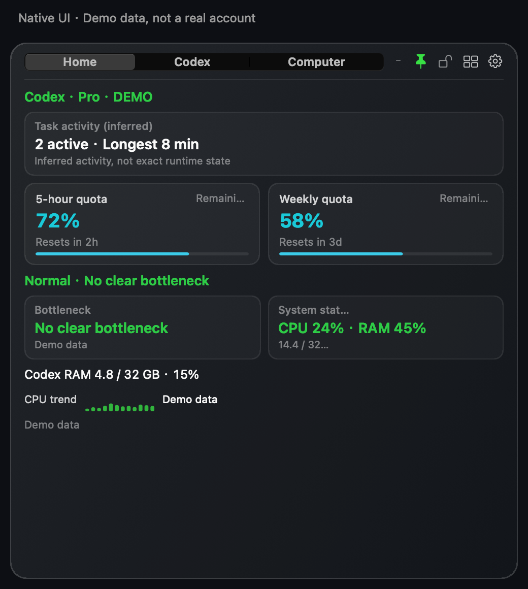
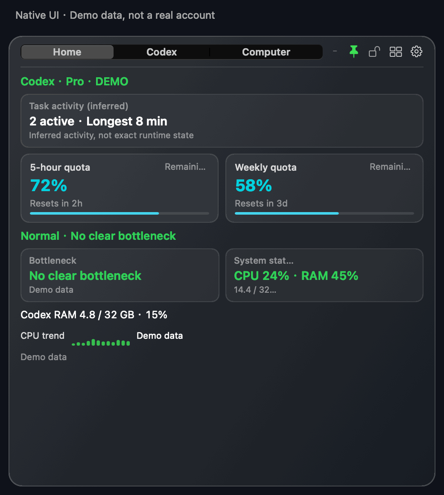

# Codex Monitor HUD

**See your remaining Codex quota at a glance—and check how much of your computer's CPU and memory Codex is using.**

[简体中文](README.md) · [繁體中文](README.zh-Hant.md) · English · [日本語](README.ja.md) · [한국어](README.ko.md)

A customizable floating window for quota, token and estimated cost trends, local task activity, and system performance. Both always-on interfaces are native; macOS can open a separate, short-lived official billing page on demand. A community project, not an official OpenAI product.

## Download 1.4.0

| Platform | Download | Before installing |
|---|---|---|
| macOS 15+ · Apple silicon / Intel | **[macOS ZIP](https://github.com/Ryuaaa/codex-monitor-hud/releases/download/v1.4.0/Codex-Monitor-HUD.app.zip)** | Developer ID signed and Apple notarized. Unzip and move to Applications. |
| Windows 10/11 · x64 | **[Windows MSI](https://github.com/Ryuaaa/codex-monitor-hud/releases/download/windows-preview-v1.4.0/CodexMonitorHUD-windows-x64-1.4.0.msi)** · [Portable ZIP](https://github.com/Ryuaaa/codex-monitor-hud/releases/download/windows-preview-v1.4.0/CodexMonitorHUD-windows-x64.zip) | Unsigned preview; Windows may block it. Do not disable security protections. |

[macOS release & checksums](https://github.com/Ryuaaa/codex-monitor-hud/releases/tag/v1.4.0) · [Windows release & checksums](https://github.com/Ryuaaa/codex-monitor-hud/releases/tag/windows-preview-v1.4.0)

Platform difference: optional billing-date sync from the official website is available on macOS only; Windows keeps manual date entry. The always-on monitor remains native on both platforms.

## See it in action

*Rendered with the actual 1.3.0 native UI components. All numbers and task names are fictional examples, not a real account, performance benchmark, or bill. Windows has a different native interface.*

9-second tour: Home → Codex → Computer

A three-frame page tour, not a live screen recording. [Codex still](docs/images/codex-en.png) · [Computer still](docs/images/computer-en.png)

## What it helps with

- **Fewer clicks:** see 5-hour and weekly quota remaining and reset times; hide either independently.
- **Resource pressure:** compare system and Codex CPU and memory usage, including percentages, to help identify bottlenecks.
- **Usage trends:** compare 5-hour, rolling 24-hour and current-week tokens, plus API-equivalent cost estimates since installation.
- **Task awareness:** see inferred local activity and recent task history. Open the separate Task Center on demand for fuller task management.
- **Your layout:** choose home modules, size, colors and opacity; toggle always-on-top or minimize.
- **Your language and currency:** Simplified Chinese, Traditional Chinese, English, Japanese and Korean; CNY by default, with USD, EUR, JPY and KRW options.

## Getting started

1. Download the package for your operating system. System monitoring works independently; Codex quota requires a supported, installed and signed-in Codex / ChatGPT client.
2. Open the gear menu to choose modules, language and currency. Restart the HUD to apply language changes; currency changes apply immediately.
3. macOS users can use Check for Updates. Windows unsigned-preview users need to download updates manually. Activity Monitor does not need to be open.

**Know the limits:** quota comes from official interfaces. Local task activity is inferred, not a complete live runtime status. Costs estimate API-equivalent usage, not your Pro subscription bill. Missing history is not invented; subscription dates are entered manually. Monitoring data is not uploaded, and translations are offline. Updates, exchange rates and optional service status use their respective public services. [Privacy details (Chinese)](PRIVACY.md)

## Feedback and support

[Open an issue](https://github.com/Ryuaaa/codex-monitor-hud/issues) with your OS, app version and reproduction steps. Remove task content, account details and credentials before sharing screenshots or logs. Translation suggestions are welcome.

If it saves you time, consider clicking **Star** at the top of the repository. Starring is optional; the project is free and MIT-licensed.

## Task Center and technical documentation

The [separate Task Center](task-center/README.md) starts on demand and exits when closed; the full board does not run inside the always-on HUD. Technical reference is currently in Chinese: [complete reference & source build](README.md#technical-details) · [Windows guide](windows/README.md) · [changelog](CHANGELOG.md) · [macOS validation](docs/hud-1.3.0-validation.md) · [Windows validation](docs/hud-1.3.0-windows-validation.md).
