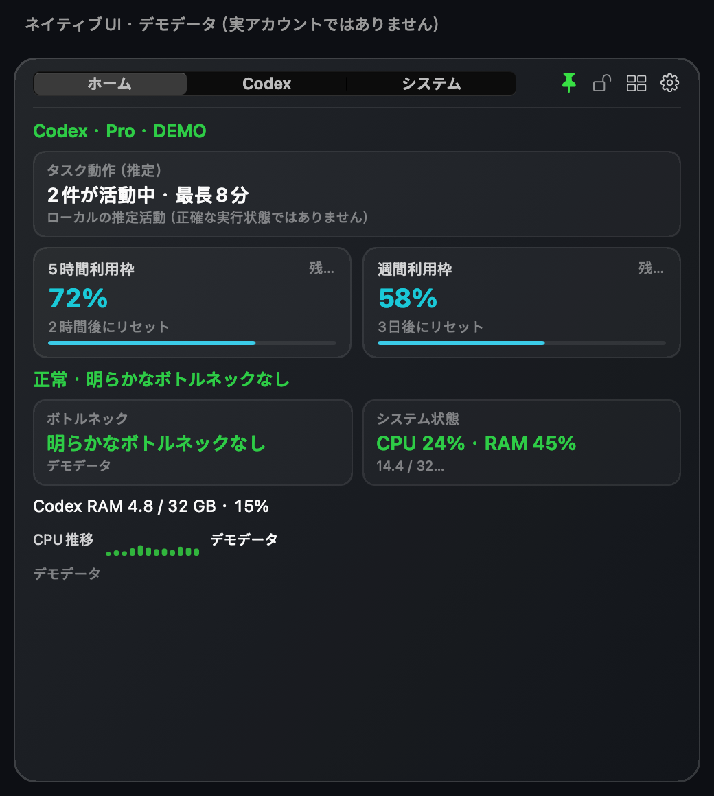
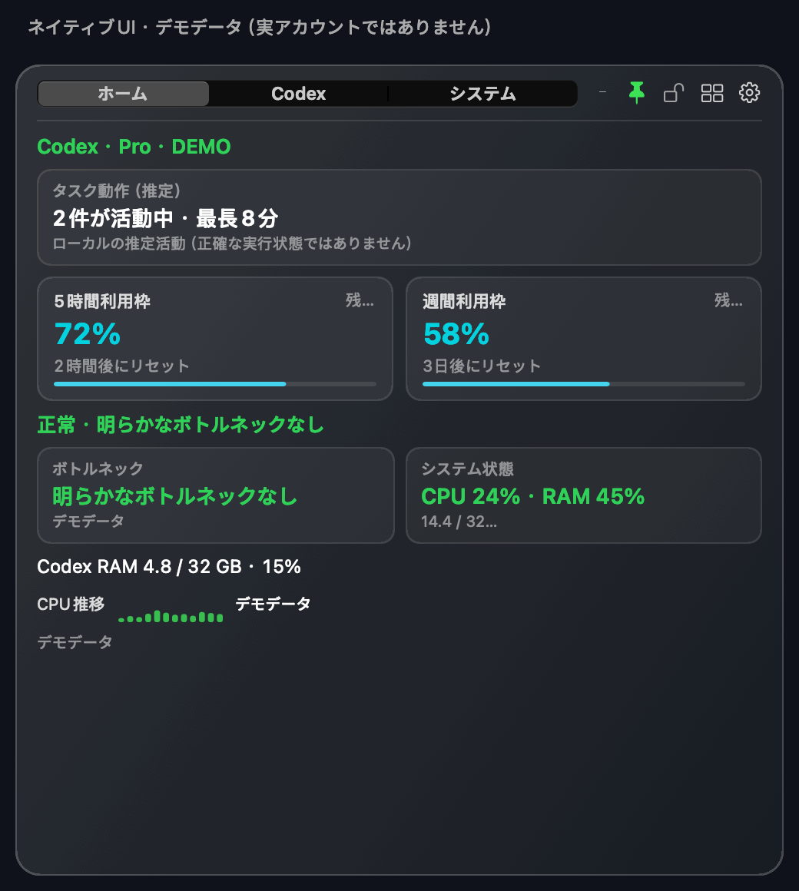

# Codex Monitor HUD

**Codex の残り利用枠をひと目で確認。パソコンの負荷と、Codex の CPU・メモリ使用量もまとめて表示。**

[简体中文](README.md) · [繁體中文](README.zh-Hant.md) · [English](README.en.md) · 日本語 · [한국어](README.ko.md)

画面の隅に置ける、カスタマイズ可能なフローティングウィンドウです。利用枠、トークンと推定コストの傾向、ローカルのタスク活動、システム負荷を確認できます。macOS・Windows ともにネイティブ実装で、ブラウザエンジンは内蔵しません。OpenAI 公式製品ではなく、コミュニティによるツールです。

## 1.3.0 をダウンロード

| 対応環境 | ダウンロード | インストール前の注意 |
|---|---|---|
| macOS 15 以降 · Apple シリコン／Intel | **[macOS ZIP](https://github.com/Ryuaaa/codex-monitor-hud/releases/download/v1.3.0/Codex-Monitor-HUD.app.zip)** | Developer ID 署名・Apple 公証済み。解凍して「アプリケーション」に移動してください。 |
| Windows 10/11 · x64 | **[Windows MSI](https://github.com/Ryuaaa/codex-monitor-hud/releases/download/windows-preview-v1.3.0/CodexMonitorHUD-windows-x64-1.3.0.msi)** · [ポータブル ZIP](https://github.com/Ryuaaa/codex-monitor-hud/releases/download/windows-preview-v1.3.0/CodexMonitorHUD-windows-x64.zip) | 未署名のプレビュー版です。Windows にブロックされる場合があります。セキュリティ機能を無効にしないでください。 |

[macOS リリース・チェックサム](https://github.com/Ryuaaa/codex-monitor-hud/releases/tag/v1.3.0) · [Windows リリース・チェックサム](https://github.com/Ryuaaa/codex-monitor-hud/releases/tag/windows-preview-v1.3.0)

## 画面を見る

*1.3.0 の実際のネイティブ UI コンポーネントで描画したデモです。数値・タスク名はすべて架空で、実アカウント、性能測定結果、請求額ではありません。Windows のネイティブ画面は外観が異なります。*

9 秒の画面ツアー：ホーム → Codex → システム

3 枚のネイティブ画面を順に表示するデモで、リアルタイムの画面録画ではありません。[Codex の静止画](docs/images/codex-ja.png) · [システムの静止画](docs/images/computer-ja.png)

## できること

- **確認の手間を減らす：**5 時間枠・週次枠の残量とリセット時刻を表示。それぞれ個別に非表示にできます。
- **負荷を把握する：**システム全体と Codex の CPU・メモリ使用量、割合を分けて表示し、ボトルネックの判断を補助します。
- **利用傾向を見る：**5 時間・直近 24 時間・今週のトークンを比較し、インストール後の API 相当コストを推定します。
- **タスクの活動を確認：**ローカルで推定した活動と最近のタスク履歴を表示。詳しい管理には、独立した Task Center を必要なときだけ開けます。
- **自分に合う表示：**ホームのモジュール、サイズ、色、透明度を選択。最前面表示と最小化にも対応します。
- **言語と通貨：**簡体字中国語・繁体字中国語・英語・日本語・韓国語。通貨は CNY が初期設定で、USD・EUR・JPY・KRW に切り替えられます。

## はじめて使う

1. OS に合うパッケージをダウンロードします。システム監視は単独で利用できます。Codex の利用枠表示には、対応する Codex／ChatGPT クライアントのインストールとログインが必要です。
2. 歯車から表示モジュール、言語、通貨を選びます。言語変更は HUD の再起動後、通貨変更はすぐに反映されます。
3. macOS は「更新を確認」から更新できます。Windows の未署名プレビューは手動で新しい版をダウンロードしてください。「アクティビティモニタ」を開いておく必要はありません。

**制限事項：**利用枠は公式インターフェースから取得します。タスク活動はローカルの推定で、全タスクの正確なリアルタイム状態ではありません。コストは API 相当額の推定で、Pro サブスクリプションの請求額ではありません。欠落した履歴は推測で補わず、契約日はユーザーが手入力します。監視データはアップロードせず、翻訳はオフラインです。更新、為替レート、任意のサービス状態表示には、それぞれの公開サービスへ接続します。[プライバシー詳細（中国語）](PRIVACY.md)

## フィードバックと応援

不具合や提案は、OS・アプリのバージョン・再現手順を添えて [Issue](https://github.com/Ryuaaa/codex-monitor-hud/issues) へ。画像やログを共有する前に、タスク本文、アカウント情報、認証情報を取り除いてください。翻訳の改善提案も歓迎します。

役に立ったら、リポジトリ右上の **Star** で応援していただけるとうれしいです。Star は任意です。MIT ライセンスの無料オープンソースです。

## Task Center と技術資料

[独立した Task Center](task-center/README.md) は必要時に起動し、閉じると終了します。常駐 HUD の中でフル機能のボードを動かし続けません。以下の詳細資料は現在中国語です：[技術説明・ソースからのビルド](README.md#technical-details) · [Windows ガイド](windows/README.md) · [変更履歴](CHANGELOG.md) · [macOS 検証](docs/hud-1.3.0-validation.md) · [Windows 検証](docs/hud-1.3.0-windows-validation.md)。
