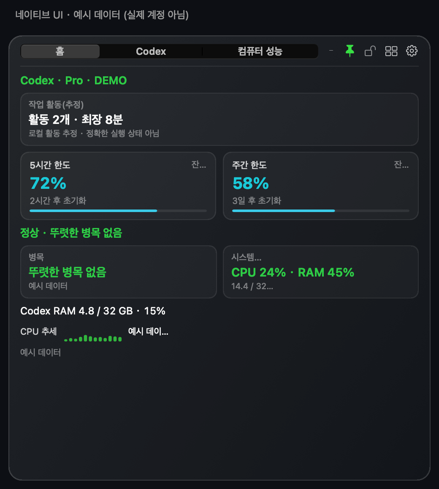
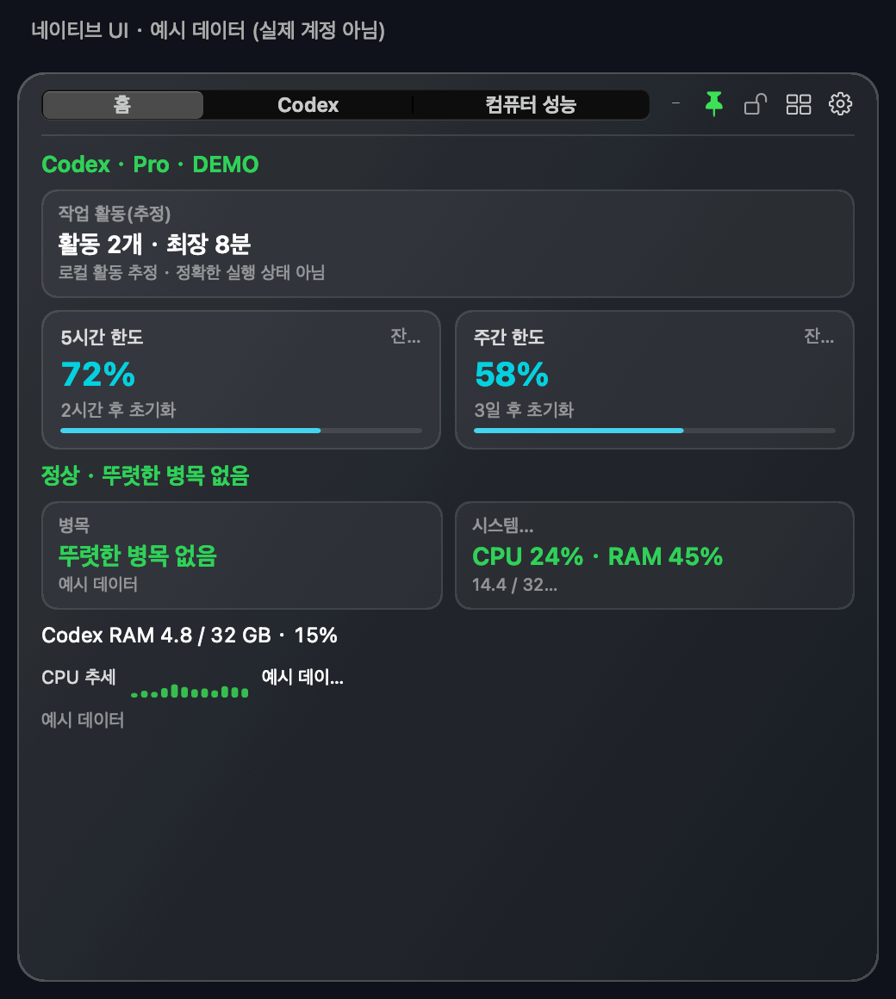

# Codex Monitor HUD

**Codex의 남은 사용 한도를 한눈에 확인하고, 컴퓨터의 부하와 Codex의 CPU·메모리 사용량을 살펴보세요.**

[简体中文](README.md) · [繁體中文](README.zh-Hant.md) · [English](README.en.md) · [日本語](README.ja.md) · 한국어

화면 구석에 띄워 두는 맞춤형 창입니다. 사용 한도, 토큰·추정 비용 추이, 로컬 작업 활동, 시스템 성능을 확인할 수 있습니다. 두 운영체제의 상주 화면은 네이티브 UI입니다. macOS에서는 필요할 때만 별도의 짧은 공식 청구 페이지 창을 열 수 있습니다. OpenAI 공식 제품이 아닌 커뮤니티 도구입니다.

## 1.4.0 다운로드

| 운영체제 | 다운로드 | 설치 전 안내 |
|---|---|---|
| macOS 15 이상 · Apple Silicon / Intel | **[macOS ZIP](https://github.com/Ryuaaa/codex-monitor-hud/releases/download/v1.4.0/Codex-Monitor-HUD.app.zip)** | Developer ID 서명 및 Apple 공증 완료. 압축을 풀어 응용 프로그램 폴더로 옮기세요. |
| Windows 10/11 · x64 | **[Windows MSI](https://github.com/Ryuaaa/codex-monitor-hud/releases/download/windows-preview-v1.4.0/CodexMonitorHUD-windows-x64-1.4.0.msi)** · [포터블 ZIP](https://github.com/Ryuaaa/codex-monitor-hud/releases/download/windows-preview-v1.4.0/CodexMonitorHUD-windows-x64.zip) | 서명되지 않은 미리보기 버전으로, Windows에서 차단할 수 있습니다. 보안 기능을 끄지 마세요. |

[macOS 릴리스·체크섬](https://github.com/Ryuaaa/codex-monitor-hud/releases/tag/v1.4.0) · [Windows 릴리스·체크섬](https://github.com/Ryuaaa/codex-monitor-hud/releases/tag/windows-preview-v1.4.0)

플랫폼 차이: 공식 웹사이트에서 청구 날짜를 동기화하는 선택 기능은 macOS에서만 제공됩니다. Windows는 날짜를 수동으로 입력합니다. 상주 모니터는 두 플랫폼 모두 네이티브입니다.

## 화면 미리 보기

*1.3.0의 실제 네이티브 UI 구성 요소로 렌더링한 데모입니다. 수치와 작업 이름은 모두 가상의 예시이며 실제 계정, 성능 측정 결과 또는 청구액이 아닙니다. Windows는 자체 네이티브 UI를 사용하므로 모양이 다릅니다.*

9초 화면 둘러보기: 홈 → Codex → 컴퓨터 성능

네이티브 화면 세 장을 순서대로 보여 주는 데모이며 실시간 화면 녹화가 아닙니다. [Codex 정지 화면](docs/images/codex-ko.png) · [컴퓨터 성능 정지 화면](docs/images/computer-ko.png)

## 어떤 도움이 되나요?

- **확인에 드는 클릭 줄이기:** 5시간·주간 잔여 한도와 초기화 시간을 표시하며 각각 따로 숨길 수 있습니다.
- **자원 부담 파악:** 시스템 전체와 Codex의 CPU·메모리 사용량 및 비율을 구분해 병목 판단을 돕습니다.
- **사용 추이 확인:** 5시간, 최근 24시간, 이번 주 토큰을 비교하고 설치 이후의 API 환산 비용을 추정합니다.
- **작업 활동 살펴보기:** 로컬에서 추정한 활동과 최근 작업 기록을 보여 줍니다. 상세한 관리가 필요하면 별도의 Task Center를 열 수 있습니다.
- **편안한 화면 구성:** 홈 모듈, 크기, 색상, 투명도를 선택하고 항상 위 표시와 최소화를 전환할 수 있습니다.
- **언어·통화 선택:** 중국어 간체·번체, 영어, 일본어, 한국어를 지원합니다. 기본 통화는 CNY이며 USD·EUR·JPY·KRW로 바꿀 수 있습니다.

## 처음 사용하기

1. 운영체제에 맞는 파일을 다운로드하세요. 시스템 모니터링은 독립적으로 작동합니다. Codex 한도 표시에는 지원되는 Codex / ChatGPT 클라이언트를 설치하고 로그인해야 합니다.
2. 톱니바퀴에서 표시할 모듈, 언어, 통화를 선택하세요. 언어는 HUD를 다시 실행하면 적용되고 통화는 즉시 적용됩니다.
3. macOS는 업데이트 확인 기능을 사용할 수 있습니다. Windows의 미서명 미리보기 버전은 새 파일을 직접 다운로드해야 합니다. 활성 상태 보기를 켜 둘 필요는 없습니다.

**알아둘 제한:** 한도는 공식 인터페이스에서 읽습니다. 작업 활동은 로컬 추정치이며 모든 작업의 정확한 실시간 상태가 아닙니다. 비용은 API 환산 추정액이지 Pro 구독 청구액이 아닙니다. 누락된 기록을 임의로 만들지 않으며 구독 날짜는 사용자가 직접 입력합니다. 모니터링 데이터는 업로드하지 않고 번역은 오프라인으로 처리합니다. 업데이트, 환율, 선택적 서비스 상태 표시는 각각의 공개 서비스에 접속합니다. [개인정보 처리 상세 안내(중국어)](PRIVACY.md)

## 피드백과 응원

문제나 제안은 운영체제, 앱 버전, 재현 방법과 함께 [Issue](https://github.com/Ryuaaa/codex-monitor-hud/issues)로 알려 주세요. 이미지나 로그를 공유하기 전에 작업 본문, 계정 정보, 인증 정보를 지워 주세요. 번역 개선 제안도 환영합니다.

도움이 되었다면 저장소 오른쪽 위의 **Star**로 응원해 주세요. Star는 선택 사항입니다. MIT 라이선스의 무료 오픈소스입니다.

## Task Center와 기술 자료

[별도의 Task Center](task-center/README.md)는 필요할 때 실행하고 닫으면 종료됩니다. 상시 실행되는 HUD 안에서 전체 작업 보드를 계속 돌리지 않습니다. 아래 상세 자료는 현재 중국어입니다: [기술 설명·소스 빌드](README.md#technical-details) · [Windows 안내](windows/README.md) · [변경 기록](CHANGELOG.md) · [macOS 검증](docs/hud-1.3.0-validation.md) · [Windows 검증](docs/hud-1.3.0-windows-validation.md).
