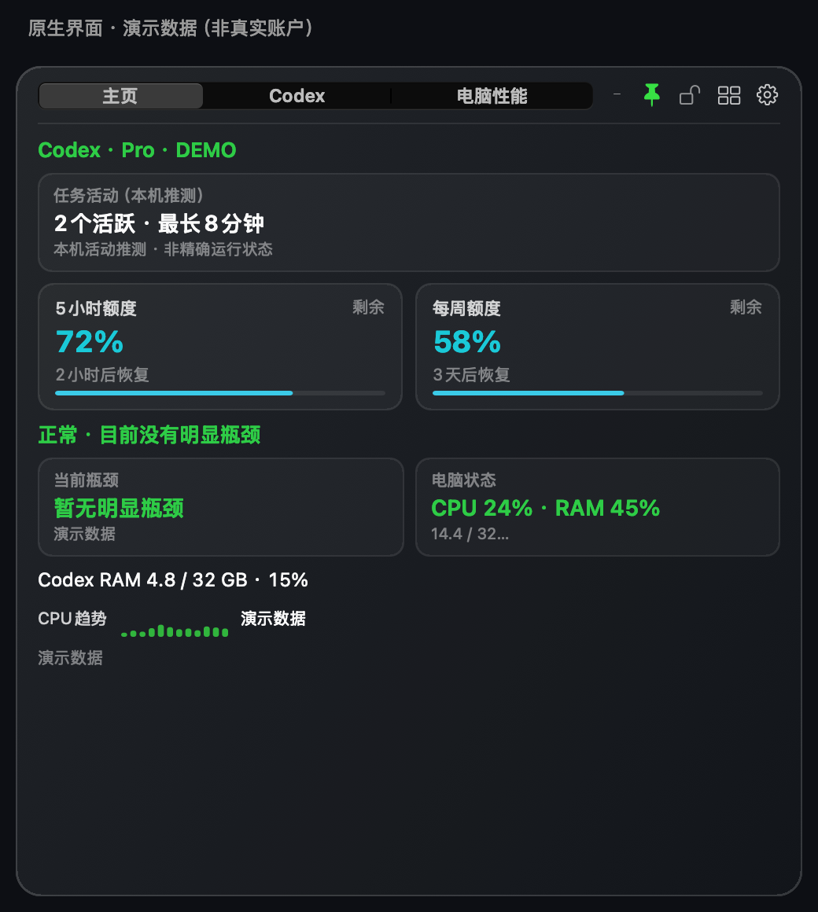
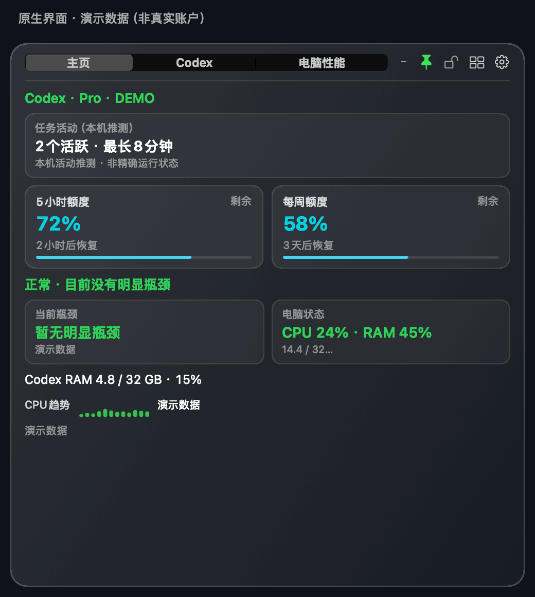

# Codex Monitor HUD

**随时查看 Codex 剩余额度，并判断电脑是否吃紧、Codex 占用了多少资源。**

简体中文 · [繁體中文](README.zh-Hant.md) · [English](README.en.md) · [日本語](README.ja.md) · [한국어](README.ko.md)

常驻屏幕角落的可自定义悬浮窗：额度、Token 与估算费用、任务活动和 CPU / 内存，在需要时一眼看清。macOS 与 Windows 均采用原生界面，不嵌入浏览器引擎。本项目是社区工具，非 OpenAI 官方产品。

## 下载 1.3.0

| 你的电脑 | 下载 | 安装前须知 |
|---|---|---|
| macOS 15+ · Apple 芯片 / Intel | **[下载 macOS ZIP](https://github.com/Ryuaaa/codex-monitor-hud/releases/download/v1.3.0/Codex-Monitor-HUD.app.zip)** | 已通过 Apple 签名、公证；解压后移入“应用程序” |
| Windows 10/11 · x64 | **[下载 Windows MSI](https://github.com/Ryuaaa/codex-monitor-hud/releases/download/windows-preview-v1.3.0/CodexMonitorHUD-windows-x64-1.3.0.msi)** · [便携 ZIP](https://github.com/Ryuaaa/codex-monitor-hud/releases/download/windows-preview-v1.3.0/CodexMonitorHUD-windows-x64.zip) | 未签名预览版，可能被系统拦截；不要关闭安全功能 |

[macOS 发布与校验文件](https://github.com/Ryuaaa/codex-monitor-hud/releases/tag/v1.3.0) · [Windows 发布与校验文件](https://github.com/Ryuaaa/codex-monitor-hud/releases/tag/windows-preview-v1.3.0)

## 一眼看懂



*这是 1.3.0 原生界面组件渲染的演示，所有数值与任务名均为虚构示例，不是用户账户、实测性能结果或账单。Windows 使用自己的原生界面，外观不同。*

<details>
<summary>看 9 秒三页演示：主页 → Codex → 电脑性能</summary>



三帧原生页面轮播，不是实时屏幕录制。[Codex 静态图](docs/images/codex-zh-Hans.png) · [电脑性能静态图](docs/images/computer-zh-Hans.png)

</details>

## 它能帮你做什么

- **少点几次界面：**看 5 小时 / 每周剩余额度与恢复时间，两项可独立隐藏。
- **找到资源压力：**分开看整机和 Codex 的 CPU、内存用量及比例，辅助定位瓶颈。
- **理解使用趋势：**对照 5 小时、滚动 24 小时和本周 Token；查看安装后的 API 等价费用估算。
- **留意任务活动：**查看本机推测的活动和最近任务历史；需要完整管理时按需打开独立任务中心。
- **按自己习惯显示：**自由组合主页模块、调整大小、颜色、透明度，切换置顶和最小化。
- **使用熟悉的语言和币种：**简中 / 繁中 / 英 / 日 / 韩；人民币默认，可切换美元、欧元、日元、韩元。

## 第一次使用

1. 下载对应系统的安装包。电脑性能可独立监控；Codex 额度功能需要本机安装并登录受支持的 Codex / ChatGPT 客户端。
2. 点击齿轮，选择想显示的模块、语言与币种。语言重启生效，币种立即生效。
3. macOS 可通过“检查更新”升级；Windows 未签名预览需手动下载新版。软件无需打开“活动监视器”。

**重要边界：**额度来自官方接口；任务活动是本机推测，不是完整实时任务状态。费用是 API 等价估算，不是 Pro 订阅账单。历史缺失时不猜数；订阅日期可手填，macOS 可选择短时读取官方账单页，自动读取并不能保证适用于所有账号。监控数据不上传，语言包不联网翻译；更新、汇率和可选服务状态会访问对应公开服务。[隐私说明](PRIVACY.md)

## 反馈与参与

遇到问题或有建议，欢迎[提交 Issue](https://github.com/Ryuaaa/codex-monitor-hud/issues)。请写明系统、版本和复现步骤；分享截图或日志前移除任务正文、账户资料与凭据。翻译建议也欢迎。

如果它帮你省了时间，欢迎点击仓库右上角 **Star** 收藏支持。不需要 Star 也可以免费使用，MIT 开源。

## 任务中心与技术资料

[独立任务中心](task-center/README.md)按需打开、关闭后退出，不把完整看板放进常驻 HUD。[Windows 说明](windows/README.md) · [更新记录](CHANGELOG.md) · [macOS 验收](docs/hud-1.3.0-validation.md) · [Windows 验收](docs/hud-1.3.0-windows-validation.md)

<a id="technical-details"></a>
<details>
<summary>展开完整技术说明、统计口径与源码构建方法（简体中文）</summary>

## 完整说明

> 同仓库的第二个独立应用“Codex Monitor 任务中心”位于 `task-center/`。HUD 顶栏和应用菜单可按需打开它；任务中心关闭后退出，不会链接到或改变 HUD 的常驻运行层。架构与验收记录见 `docs/task-center/`。

> 当前HUD版本：macOS 1.3.0正式版，使用Developer ID签名并通过Apple公证；Windows 1.3.0未签名预览版，同步计数修复、显示语言、币种及订阅日期。任务中心独立发布。

> 1.3.0双平台验收已通过：macOS完成本机替换与签名公证验证；Windows完成58项测试、原生窗口运行、MSI安装/卸载与旧版升级验证。Windows可信签名及个人实体电脑长期验证尚未完成，预览包不进入正式自动安装通道。[macOS验收记录](docs/hud-1.3.0-validation.md) · [Windows验收记录](docs/hud-1.3.0-windows-validation.md)。

### 1.3.0 统计与显示口径

- 只计算安装后、最近最多30天内能够读取的本机新增记录；继承的子任务累计值只建立基线，不再次计入。明确零基线之后的首笔真实新增仍计入。重复/倒退累计值不会增加数量。
- 费用按 **2026-09-11 OpenAI Standard API参考价** 折算，不是订阅扣款或真实账单；不还原历史优惠、Fast、Batch、工具及区域加价。未知模型保留Token但不猜价格，显示计价覆盖率。原始文件缺失及无法区分继承量的首笔会造成保守缺口。
- 旧缓存逐批重新解析，原安装日期不重置。首次迁移保留独立的`before-counting-repair`备份；尚未重算的旧金额不混入新总额。每轮扫描仍最多64MB，不新增常驻扫描服务。
- 语言：简体中文、繁体中文、English、日本語、한국어；在“语言与币种”设置，重新打开HUD后生效。传统汉字由系统转换，其他三种语言使用内置文案，不联网翻译任务内容。
- 默认人民币CNY，支持USD/EUR/JPY/KRW，立即切换。公开参考汇率最多每天异步读取一次，失败保留原汇率并显示日期。Token统计不随语言或币种改变。
- 费用主卡保留金额与Token数，完整趋势/覆盖率和口径可悬停查看；价格来源：[OpenAI官方定价](https://developers.openai.com/api/docs/pricing)。汇率来源：[Frankfurter](https://api.frankfurter.dev/v1/latest?base=USD&symbols=CNY,EUR,JPY,KRW)。

这是一个常驻在电脑屏幕角落的原生三页面悬浮窗：主页可自由组合Codex和电脑模块，Codex页显示账户额度、订阅与Token用量，电脑性能页用来快速判断电脑是否吃紧、是否主要由 Codex 引起、瓶颈在 CPU 还是内存。macOS版使用AppKit，Windows版使用Win32 + C++17；两者都不嵌入网页浏览器引擎。

界面使用原生 AppKit 深色半透明材质、静态高光和卡片层级实现，不嵌入网页浏览器引擎；视觉接近HTML原型，同时避免额外的浏览器进程和持续动画负担。

应用图标使用“小烈刀的AI宇宙”原创人物IP：低饱和灰蓝线稿、透明橙色发夹，以及对应性能监控的仪表环和柱形图；在小尺寸下优先保留人物、发夹和工具属性的辨识度。

## Codex页面

- 可选显示“任务活动（本机推测）”：显示最近活跃任务数量、最长活动时长和最多3个任务标题；活跃时每5秒、空闲时每20秒判断一次。
- 新增“最近任务（历史）”：通过官方任务列表显示最近3个任务标题和更新时间，明确不把历史列表冒充为正在运行的任务。
- Codex桌面版正在运行的 App Server 只通过桌面版自身的标准输入输出连接，外部悬浮窗无法直接取得它的内存中运行状态。因此本工具把官方任务列表中的标题、任务开始时间和文件路径，与本机会话文件最近写入情况组合判断；结果用于快速观察，不冒充官方精确的“运行中”状态。
- 显示5小时和每周额度的剩余百分比与恢复倒计时；两项拥有独立开关，默认同时显示。
- 额度改为优先读取官方 `account/rateLimits/read`；区分“实时”、“本轮未返回，显示上次”、“已过期”和“官方触顶”。从未返回过的可选窗口只显示“当前未返回”，不当成错误或0%。
- 新增5小时、滚动24小时和当前官方每周周期的Token对比。Token总量是安装或升级后的本地5分钟精度统计，额度百分比仍是官方数据；当本地每周数据尚不完整时，不计算容易误导的“占本周百分比”。
- 新增可选的完整额度列表、官方恢复次数和历史单日峰值Token，均默认关闭。
- 新增周额度消耗提醒：默认关闭，可选自然日或滚动24小时，阈值可在1%–100%间调整。提醒优先在悬浮窗内显示，可另行开启静音系统通知；每个官方重置周期最多通知一次，数据不足或仅有旧数据时不触发。
- 订阅卡可显示手动填写的日期；macOS 用户也可点击“登录并同步官方账单”，在独立短时窗口登录后尝试读取本期到期或续费日期。读取结果标明来源与取消续订状态；失败保留旧日期，仍可手填。每天自动尝试同步默认关闭，用户可自行开启；此功能依赖网页结构，并非官方订阅日期接口，也不保证所有套餐及付款渠道都可读。通过 Apple 或 Google Play 付款、或网页未明确显示日期时，应在原付款渠道核对后手填。
- “Token用量与费用”采用安装后本机会话记录的Token、模型与输入/输出结构，统计30天Token并估算API等价费用及本月趋势；不补算安装前费用。官方账户Token统计是另一个独立可选模块，不混入本地费用总量。费用在卡片中只标一次“估算”。该模块默认显示，主页和Codex页可分别关闭。
- “额度趋势预测”根据同一额度窗口内的剩余百分比变化判断按当前速度能否撑到重置，至少积累15分钟后显示；5小时与每周窗口分别计算。
- “OpenAI服务状态”直接读取官方公开状态页中的“Codex in ChatGPT Desktop”和OpenAI整体状态，用来辅助区分官方故障、本机网络和账号问题。主页和Codex页均默认关闭，开启后才会请求状态页。
- 官方“账户Token统计”保留为可选模块；接口尚未返回今天的数据时显示“最新日期 + 对应用量”，不会把缺失写成0。升级到本地统计的版本后，该模块默认关闭，仍可重新勾选。
- 模型专属额度属于高级显示，默认关闭；只有接口确实返回独立额度时才出现。
- 最长单次任务时长和历史最长连续天数可分别加入主页或Codex页，默认关闭。
- Codex账户数据和任务元数据采用智能刷新：正常或空闲时每5分钟，额度低于15%且仍有任务活动时每1分钟读取一次；连接失败按1、2、4、5分钟退避，不兼容或认证问题维持5分钟。读取后退出接口进程，各模块失败互不覆盖有效数据。
- 后台额度读取省略恢复次数逐项明细，启动和手动刷新仍完整读取；旧版接口拒绝参数时只回退一次，并记住本次Codex版本的兼容能力。不增加定时器或刷新频率。
- 官方明确返回普通包含用量不可用时显示提示；字段缺失、为空或过期时不自行判断。线程卸载与任务完成严格区分，不为维持加载而恢复或持续订阅线程。

## 常驻显示

- 总体判断：正常、CPU 较高、CPU 吃紧、内存吃紧或系统热压力限制性能。
- CPU：整机占用与 Codex 占整机总算力的比例。
- 内存：整机已用内存 / 总内存 / 百分比，以及Codex原生常驻内存和它占总内存的百分比；两组数据分开标注。
- 内存排行：电脑性能页直接显示内存占用最高的5个软件、占用GB及总内存百分比；每20秒更新一次。
- 诊断卡片：显示当前瓶颈、Codex影响程度和启发式判断置信度，不把相关性说成已证明的因果。
- 趋势：复用现有采样在内存中绘制CPU曲线；未采满10分钟时显示实际采样时长，采满后显示近10分钟，不增加新的采集进程。
- 健康状态：macOS 内存压力、交换空间及十分钟变化、系统热压力等级。这里不是摄氏温度。

点击顶部标签切换主页、Codex和电脑性能页面。齿轮会打开集中设置窗口，主页、Codex页和电脑性能页的全部勾选状态可同时查看；关闭某项后，它的卡片、状态文字和详细文字会一起隐藏。设置中还可拖动调整主页Codex模块和电脑模块的上下顺序，并直接查看每类数据的来源与所需权限。顶部减号会把窗口真正最小化到macOS程序栏（Dock），点击程序栏图标即可恢复；图钉按钮可切换置顶，锁形按钮可锁定位置和大小，避免误拖动。悬浮窗可直接拖动任意边角连续等比调整整体大小，最小为75%，最大尺寸按照当前页面内容和屏幕可用空间自动决定；拖拽过程中卡片、文字和图形不会被单向拉伸，设置和右键菜单可恢复标准大小。主页高度会随已选模块增长，不再因固定上限裁掉底部内容。右键菜单继续提供颜色、透明度、刷新频率、四角位置、窄栏模式、趋势记录、登录后自动启动和检查更新。

展开详细显示后，还可以看到 Codex 进程构成、最大单进程、Codex 磁盘读写、整机网络速度，以及 CPU 和内存排名靠前的软件。

## 采集频率与负担

- CPU、Codex 内存和进程树：每 5 秒。
- 网络、交换空间：每 10 秒；全部软件排名：每 20 秒。
- 系统热压力等级：每 20 秒。
- Codex任务活动：有活跃任务时每5秒、空闲时每20秒只检查最近写入的本机会话文件；单个候选最多读取末尾1MB。官方账户和任务列表正常或空闲时每5分钟、低额度且有活动时每1分钟读取一次；失败按上述规则退避，列表限制为最近64项并优先使用状态数据库。
- 官方任务列表中的工作目录优先采用状态数据库保存的最新值；若会话记录已迁移、压缩或暂不可读，工具不会启动持续解压任务，也不会把缺失记录显示成“0个活跃任务”，而会明确标注无法可靠判断或仅显示可确认部分。
- 本机模型与费用样本每5分钟在低优先级后台增量更新。每轮最多读取64MB，普通正文流式跳过，单行最多保留512KB；补齐完成后只读取新增部分。新用量也可能写在旧任务日期目录中，因此同一轮会按修改时间检查旧目录元数据，额外遍历最多20000项；达到上限会标记不完整，不提高刷新频率。主页和Codex页的“Token用量与费用”“Token周期对比”都关闭后停止该扫描。
- 仅请求已启用模块所需的额度、订阅、账户用量或任务列表；可选字段正常缺失不加快刷新。缓存保存前检查8MiB上限，保留上次有效备份；异常时优先恢复，无法恢复则保留原统计起点与文件并提示，不重新从今天计数。
- 额度预测只在官方额度刷新时保存剩余百分比、重置时间和采样时间，不增加新的高频定时器。
- OpenAI官方服务状态正常时每10分钟检查一次，故障或读取失败时每2分钟重试；主页和Codex页都关闭该模块后停止请求。请求不带账号、Cookie或Token。
- 已隐藏且当前不需要的排行榜、网络、交换空间和热状态停止采集；只查看Codex页且关闭历史记录时，电脑采样定时器会暂停。
- 所有定时器允许macOS在小范围内合并唤醒；隐藏模块会停止对应采集，任务活动会在5秒与20秒之间自动切换。
- 历史：每 60 秒写一条这一分钟的平均值与峰值，不保存每个 5 秒原始样本。
- 连续性：另行记录启动、系统唤醒、正常退出和本次运行实例编号，用于区分睡眠、重启与无法解释的历史缺口。

悬浮窗直接调用 macOS 底层系统接口，不需要打开或读取“活动监视器”。Codex本机接口可能按OpenAI客户端自身机制联网；软件更新功能只向本项目的GitHub公开接口检查版本，不上传监控数据。性能历史位于：

`~/Library/Application Support/CodexSystemMonitor/native-history/`

Token增量缓存和额度预测样本位于：

`~/Library/Application Support/CodexSystemMonitor/codex-cost-cache.json`

`~/Library/Application Support/CodexSystemMonitor/quota-usage-history.json`

## 数据口径

- Codex 包括 ChatGPT/Codex 主程序以及由它们启动的渲染器、工具和辅助进程。
- Codex 内存使用 macOS 提供的原生常驻内存字段，和你此前看到的量级更接近，适合判断趋势和比例；它不等于记账级的绝对独占内存。
- 整机“已用内存”按macOS虚拟内存页统计估算，口径接近活动监视器的App内存、联动内存和压缩内存合计；同时保留内存压力作为是否真正吃紧的主要判断。
- CPU 已按整机总算力归一化，100% 表示整台电脑的逻辑处理器都接近占满。
- 进程CPU累计时间会先按当前Mac的系统计时比例换算，再按逻辑处理器数量归一化；固定公式测试用于防止再次明显低报。
- Token与费用统计参考CodexBar的本地会话统计思路：费用卡片与周期对比只采用安装后的本机记录，官方账户统计独立显示。累计计数采用只升不降的高水位差值，重复快照和交错的较小累计值不会反复放大。缓存按时间桶和模型压缩保存Token计数、预计算费用、计价覆盖量，以及增量扫描所需的文件大小、修改时间、解析位置和累计高水位；会话文件路径只保存不可逆摘要，不保留会话原文。
- 费用是按OpenAI公开的标准API单价计算的API等价估算，不是Pro订阅账单，也不会产生扣款；不区分Priority、Flex、Batch、企业合同价等特殊计费档位。未知模型不会硬套价格，界面会降低“计价覆盖率”。当前内置价格核对日期为2026-08-08。
- 为显示任务活动，工具会请求官方 `thread/list`，使用任务编号、可选标题、最近活动时间和本机会话路径；有标题时会显示在悬浮窗中，没有标题时只显示“未命名任务”，不会改用任务预览。它还会短暂读取最近活跃会话文件的末尾，最多1MB，只解析记录类型、角色、阶段和时间戳，不提取、保存或显示对话正文、提示词、工具输出或命令内容。
- `thread/list` 返回的当前工作目录与不稳定的会话文件路径分开保存：工作目录用于项目归属，会话文件路径只用于本机活动趋势判断。迁移或压缩后的记录无法按原口径读取时，状态会降级为未知或部分可确认。
- Codex额度与最近任务通过随桌面版或Codex命令行工具安装的本机官方接口读取；工具不会读取浏览器Cookie或要求API密钥。由于无法连接ChatGPT桌面版正在使用的同一个App Server实例，单任务实时Token消耗速度当前不会显示。
- Codex App Server已有公开文档；本工具只调用公开文档中的账户和任务列表方法。任务路径属于官方标注的不稳定字段，因此路径缺失时会自动退回本机会话目录判断。读取仍可能因桌面版或命令行工具未安装、账号退出或认证方式不支持、网络或上游服务异常、接口超时、协议调整或可选字段暂未返回而失败；工具会保留上次数据并明确标出失败状态。

## 系统要求

- macOS正式版：macOS 15或更高版本，支持Apple芯片和Intel处理器；从源码构建需要Xcode Command Line Tools。
- Windows 1.3.0预览版：Windows 10/11 x64；暂不支持ARM64。
- 电脑性能监控可独立工作；Codex额度、订阅和用量需要本机安装并登录ChatGPT桌面版、Codex桌面版或Codex命令行工具。

## 安装或更新

不想自行构建时，可从GitHub发布页下载：

- [macOS 1.3.0](https://github.com/Ryuaaa/codex-monitor-hud/releases/tag/v1.3.0)：`Codex-Monitor-HUD.app.zip`。解压后把应用移到“应用程序”文件夹并打开；文件已经Developer ID签名并通过Apple公证。
- [macOS 任务中心 1.3.0](https://github.com/Ryuaaa/codex-monitor-hud/releases/tag/task-center-v1.3.0)：下载通用版 `.app.zip`，可查看、继续并在 Codex 中准确打开官方任务；应用按需运行，关闭后退出。
- [Windows 1.3.0未签名预览版](https://github.com/Ryuaaa/codex-monitor-hud/releases/tag/windows-preview-v1.3.0)：可下载便携ZIP和MSI安装包；Windows可能显示“未知发布者”或拦截。该预发布不进入正式自动安装通道，需手动下载；不要关闭系统安全功能。

macOS 与 Windows 使用独立更新通道：macOS 读取 `v版本号`，Windows 读取 `windows-v版本号`。两个平台不会把对方的发布当成自己的新版。

### 双平台发布顺序

每次HUD更新固定按以下顺序完成，包括当前1.3.0批次：

1. 完成macOS功能更新与相应验证。
2. 同步Windows的适用功能、修复、数据口径及产品版本号；不得只修改版本号就称为同步完成。
3. 核对两端构建、必要测试、安装包版本、校验文件及各自更新通道。平台专属差异、签名状态和未完成的真实桌面验证须明确记录，不得冒充已验证。
4. 两端均达到本轮约定验收后，再向GitHub发布同一版本的两端产物，并回读核对下载文件。可提前准备草稿和构建产物，不提前公开单端新版。

macOS与Windows保留各自更新标签和签名要求；未签名预览包不得冒充正式可信安装包或进入正式自动更新通道。外部签名或验证条件阻塞时，继续完成可独立推进的工作，明确报告剩余条件，不自行绕过验收。任务中心作为独立应用维护版本，不与HUD版本混用。

Windows可信签名尚未取得，免费签名重新申请已暂停，不承诺获批时间。只有取得可信签名并通过验收的安装包才会进入正式自动更新通道；现有更新器会核验SHA-256、固定发布者、MSI身份、版本和安装后的EXE身份。完整Windows说明见[`windows/README.md`](windows/README.md)。

```zsh
./install-overlay.sh
```

默认在左下角并覆盖普通窗口。可拖动并记住位置；拖动任意边角可调整整体大小；齿轮集中显示所有内容开关，右键菜单可调整屏幕位置、透明度、颜色、刷新频率，或打开趋势数据文件夹。新安装默认不随登录自动启动；如有需要，可在设置或右键菜单中手动开启。升级会保留旧版已有的选择。

应用启动4秒后会判断距离上次自动检查是否已满24小时，满足时才检查；长期运行时每天自动检查一次。也可随时在设置、应用菜单或右键菜单点击“检查更新”。更新来源固定为本仓库的GitHub Release。1.2.1更新器在校验摘要、应用身份、系统版本、签名和Apple认可之后替换应用，并确认同一个新进程连续五次正常启动才删除旧版备份；启动失败自动恢复，无法结束故障进程时保留备份供恢复。不增加常驻检查进程。从旧版升级到1.2.1时，实际运行的仍是旧版更新器。

发布页提供Developer ID签名并通过Apple公证的应用压缩包和SHA-256校验文件。使用0.8.0及后续版本的用户可在应用内收到并一键安装未来更新；只下载源码的用户仍可运行上面的安装脚本更新。

## 验证

```zsh
"$HOME/Applications/Codex Monitor HUD.app/Contents/MacOS/CodexMonitorHUD" --diagnostic
"$HOME/Applications/Codex Monitor HUD.app/Contents/MacOS/CodexMonitorHUD" --codex-diagnostic
"$HOME/Applications/Codex Monitor HUD.app/Contents/MacOS/CodexMonitorHUD" --cost-diagnostic
"$HOME/Applications/Codex Monitor HUD.app/Contents/MacOS/CodexMonitorHUD" --logic-diagnostic
"$HOME/Applications/Codex Monitor HUD.app/Contents/MacOS/CodexMonitorHUD" --ui-diagnostic
"$HOME/Applications/Codex Monitor HUD.app/Contents/MacOS/CodexMonitorHUD" --update-diagnostic
sh tests/test-maintenance.sh
"$HOME/Applications/Codex Monitor HUD.app/Contents/MacOS/CodexMonitorHUD" --service-status-diagnostic
"$HOME/Applications/Codex Monitor HUD.app/Contents/MacOS/CodexMonitorHUD" --singleton-diagnostic
```

第二条查询官方模块能力；可选模块未返回不等于整个接口失败。第三条验证安装后的本机Token、费用和计价覆盖率；首次运行或数据不足时显示记录起点或不完整提示。第四条包含Token解析、累计高水位、价格、长上下文、去重、增量缓存、额度预测和服务状态固定测试；第五条检查设置、位置和大小锁定、隐藏停采及等比缩放。`tests/test-maintenance.sh`使用假应用、假接口和隔离目录，覆盖异常数据、缓存及更新失败恢复，不重启真实HUD。旧的`--update-handoff-diagnostic`已停用以避免干扰正在运行的登录启动服务；真实签名升级仍属于发布前单独验收。

## Code signing policy

仓库保留SignPath签名工作流，但免费申请未获批准，重新申请已暂停；没有Windows可信签名产物。今后若取得签名资格，只允许签署本仓库公开源码经GitHub Actions从精确标签自动构建的发行文件；团队角色、审批、隐私和构建来源约束见[`CODE_SIGNING_POLICY.md`](CODE_SIGNING_POLICY.md)。

## 开源

项目采用 MIT 许可证。隐私边界见 `PRIVACY.md`。Codex是OpenAI的产品名称，本项目是社区工具，不代表OpenAI官方产品。

首次公开与发行前的核验状态见 `RELEASE_CHECKLIST.md`。

## 查看趋势报告

```zsh
"$HOME/Library/Application Support/CodexSystemMonitor/report.py" --hours 24
```

小时数可改为 `1`、`72` 或 `168`。

## 停止悬浮窗

```zsh
./uninstall-overlay.sh
```

旧的每分钟脚本采集器已停用，但脚本仍保留作可选的独立采集方式。需要启用时先运行 `./install.sh`；它与原生悬浮窗历史目录不同。

</details>
