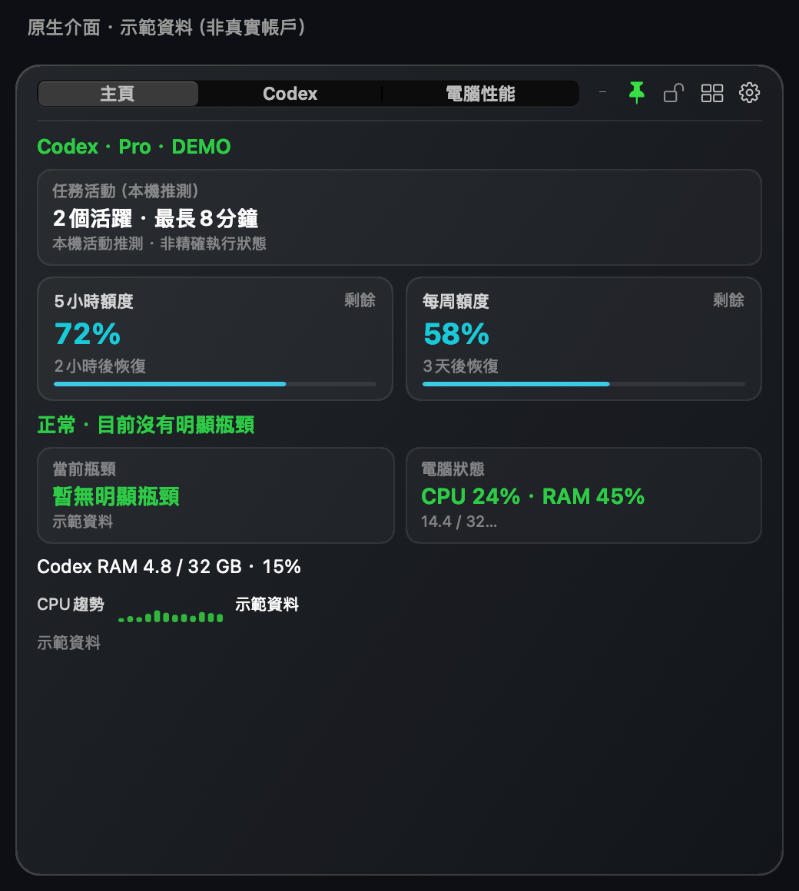
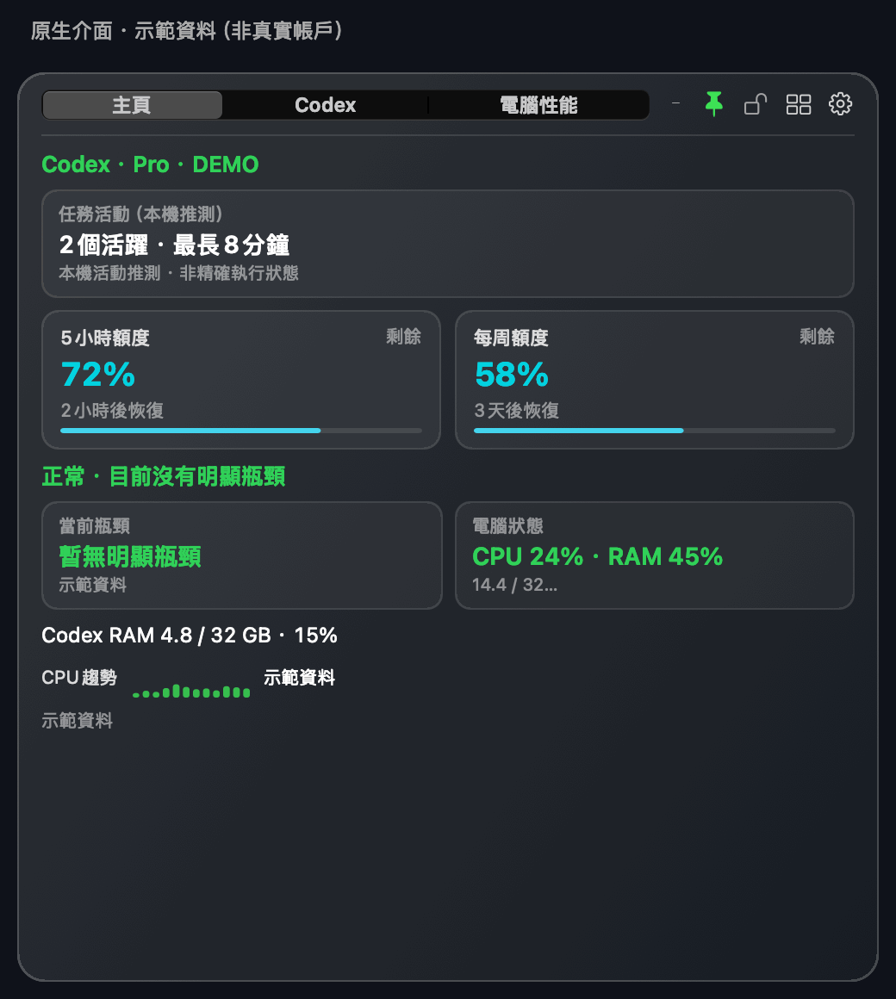

# Codex Monitor HUD

**隨時查看 Codex 剩餘額度，並判斷電腦是否吃緊、Codex 佔用了多少資源。**

[简体中文](README.md) · 繁體中文 · [English](README.en.md) · [日本語](README.ja.md) · [한국어](README.ko.md)

常駐螢幕角落的可自訂浮動視窗：額度、Token 與估算費用、任務活動和 CPU／記憶體，需要時一眼看清。macOS 與 Windows 均採用原生介面，不內嵌瀏覽器引擎。本專案是社群工具，非 OpenAI 官方產品。

## 下載 1.3.0

| 你的電腦 | 下載 | 安裝前須知 |
|---|---|---|
| macOS 15+ · Apple 晶片／Intel | **[macOS ZIP](https://github.com/Ryuaaa/codex-monitor-hud/releases/download/v1.3.0/Codex-Monitor-HUD.app.zip)** | 已通過 Apple 簽章與公證；解壓縮後移入「應用程式」 |
| Windows 10/11 · x64 | **[Windows MSI](https://github.com/Ryuaaa/codex-monitor-hud/releases/download/windows-preview-v1.3.0/CodexMonitorHUD-windows-x64-1.3.0.msi)** · [可攜式 ZIP](https://github.com/Ryuaaa/codex-monitor-hud/releases/download/windows-preview-v1.3.0/CodexMonitorHUD-windows-x64.zip) | 未簽章預覽版，可能遭系統攔截；請勿關閉安全防護 |

[macOS 發行與校驗檔](https://github.com/Ryuaaa/codex-monitor-hud/releases/tag/v1.3.0) · [Windows 發行與校驗檔](https://github.com/Ryuaaa/codex-monitor-hud/releases/tag/windows-preview-v1.3.0)

## 一眼看懂

*以 1.3.0 原生介面元件繪製的示範，所有數值與任務名稱均為虛構示例，不是真實帳戶、效能實測結果或帳單。Windows 使用自己的原生介面，外觀不同。*

9 秒三頁示範：首頁 → Codex → 電腦效能

三張原生頁面輪播，並非即時螢幕錄影。[Codex 靜態圖](docs/images/codex-zh-Hant.png) · [電腦效能靜態圖](docs/images/computer-zh-Hant.png)

## 它能幫你做什麼

- **少點幾次介面：**查看 5 小時／每週剩餘額度與重置時間，兩項可獨立隱藏。
- **找出資源壓力：**分開看整台電腦和 Codex 的 CPU、記憶體用量與比例，協助定位瓶頸。
- **理解使用趨勢：**比較 5 小時、滾動 24 小時和本週 Token，查看安裝後的 API 等價費用估算。
- **留意任務活動：**查看本機推測的活動與最近任務歷史；需要完整管理時，按需開啟獨立任務中心。
- **依個人習慣顯示：**自訂首頁模組、大小、顏色、透明度，切換置頂與最小化。
- **熟悉的語言與幣別：**簡中／繁中／英／日／韓；預設人民幣（CNY），可切換美元（USD）、歐元（EUR）、日圓（JPY）、韓元（KRW）。

## 第一次使用

1. 下載對應作業系統的安裝包。電腦效能可獨立監控；Codex 額度功能需要本機安裝並登入受支援的 Codex／ChatGPT 用戶端。
2. 點擊齒輪，選擇顯示模組、語言與幣別。語言重新啟動後生效，幣別立即生效。
3. macOS 可使用「檢查更新」；Windows 未簽章預覽版需手動下載新版。無須開啟「活動監視器」。

**重要限制：**額度來自官方介面；任務活動是本機推測，不是完整即時執行狀態。費用是 API 等價估算，不是 Pro 訂閱帳單。缺少的歷史不猜數；訂閱日期由使用者手填。監控資料不上傳，語言包不連網翻譯；更新、匯率及可選服務狀態會存取對應公開服務。[隱私詳情（簡中）](PRIVACY.md)

## 回饋與參與

歡迎[提交 Issue](https://github.com/Ryuaaa/codex-monitor-hud/issues)，附上作業系統、版本及重現步驟。分享截圖或紀錄前，請移除任務正文、帳戶資料與憑證；也歡迎翻譯建議。

若它幫你省了時間，歡迎點擊倉庫右上角 **Star** 收藏支持。不點 Star 也能免費使用，MIT 開源。

## 任務中心與技術資料

[獨立任務中心](task-center/README.md)按需開啟、關閉後結束，不把完整看板放進常駐 HUD。進階資料目前為簡中：[完整說明與原始碼建置](README.md#technical-details) · [Windows 說明](windows/README.md) · [更新紀錄](CHANGELOG.md) · [macOS 驗收](docs/hud-1.3.0-validation.md) · [Windows 驗收](docs/hud-1.3.0-windows-validation.md)。
